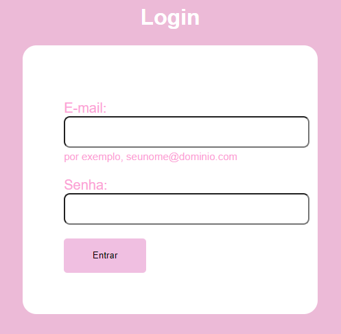

# `Form Login`

### `Objetivo`
O projeto tem objetivo de criar uma página de login utilizando HTML e CSS, contendo campos para Email, Senha e botão Acessar.

### `HTML`
No HTML foi usado outro código de projeto já pronto [form-contato](https://github.com/camilacasagrande/form-contato), e foi editado as informações para conseguir cumprir o que foi pedido na tarefa.

### `Fontes Utilizadas`
HTML & CSS

### `Resultado`

